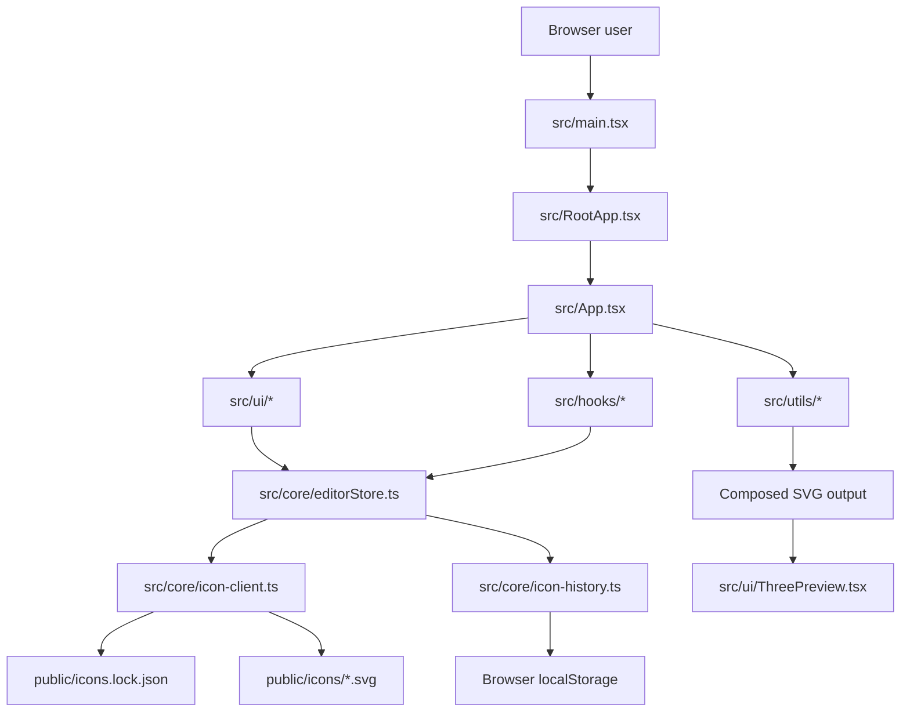

# Contributing to Aikon

Thanks for considering a contribution.

Aikon is a vibe-coded side project built in spare time. I don't have deep React knowledge yet, so if you spot a cleaner approach, feel free to suggest it.

## Ways to Contribute

You do not need to be technical to help.

- Report bugs with steps, expected behavior, and screenshots.
- Propose UX/copy improvements.
- Improve docs for beginner-friendly readability.
- Add focused tests for existing behavior.
- Submit code changes for bugs, performance, and features.

## Before You Start

- For larger changes, open an issue/discussion first.
- Keep scope small and focused. Smaller changes have a much better chance of being reviewed and merged quickly.
- Prefer incremental improvements over broad rewrites.

## Development Setup

```bash
npm install
npm run dev
```

Open: `http://localhost:5173`

## Contribution Workflow

1. Create a branch from `master`.
2. Implement one clear change at a time.
3. Follow existing project structure and naming conventions.
4. Add or update tests when behavior changes.
5. Run all quality checks locally.
6. Commit using [Conventional Commits](https://www.conventionalcommits.org/).
7. Keep history linear (`git rebase` over merge commits before opening/updating your PR).
8. Open a PR with context and evidence.

## Quality Checks (Required)

Run before opening a PR:

```bash
npm run typecheck
npm run test
npm run build
```

## Code Expectations

- Prefer simple, obvious solutions.
- Keep strong TypeScript typing.
- Keep UI logic in `src/ui` and reusable logic in `src/core`, `src/hooks`, and `src/utils`.
- Write beginner-friendly comments and docs when adding non-obvious logic.
- Update `README.md` and this Architecture section when structure or behavior changes.

## Commit Messages (Required)

Use [Conventional Commits](https://www.conventionalcommits.org/) for all commits.

## Pull Request Guidelines

Include in your PR:

- What changed and why.
- Which model/tooling you used (if AI-assisted work was involved).
- Screenshots/GIFs for UI changes.
- Validation evidence (`typecheck`, `test`, `build`).
- Any tradeoffs, known issues, or follow-up ideas.

Respond to review feedback with additional commits (or a clean rebase before merge).

## Upstream Respect (Game Icons)

Aikon uses Game Icons data and keeps a local icon copy in `public/icons`.

- Repository: <https://github.com/game-icons/icons>
- Website: <https://game-icons.net>

Please avoid excessive sync/download activity and prefer local icon assets during normal development.

## Architecture

Aikon is a local-first React app with client-side routing and no backend service.

Folder breakdown:

- `src`: application source code.
- `src/core`: domain models, routes, state, icon loading, and persistence (`editorStore`, `icon-client`, `icon-history`).
- `src/hooks`: orchestration hooks that connect UI behavior to store/data (`useIconCatalog`, `useIconAssignment`).
- `src/ui`: React UI components and page-level panels (`IconBrowserPanel`, `SelectedIconStylePanel`, `PreviewPanel`, `IconGalleryPage`, `ThreePreview`).
- `src/utils`: pure helpers for SVG transforms/composition and small utility functions.
- `public`: static assets served directly by Vite.
- `public/icons`: local SVG icon files used by the editor.
- `public/icons.lock.json`: local icon metadata index used for browsing/filtering.
- `scripts`: Node scripts for syncing and downloading icon data (`icons-sync.ts`, `icons-download.ts`, `github-sync.ts`).
- `docs`: project documentation and media.
- `dist`: build output generated by `npm run build`.

System flow diagram:



Runtime notes:

- Entry point: `src/main.tsx` mounts React + Mantine and renders `RootApp`.
- Router shell: `src/RootApp.tsx` handles `/`, `/gallery`, and `/:category/:icon`.
- Editor shell: `src/App.tsx` orchestrates store state, hooks, preview composition, and responsive layout.
- Metadata is loaded from `public/icons.lock.json`; SVG payloads are loaded from `public/icons`.
- Edit/history state is persisted in browser localStorage via `src/core/icon-history.ts`.
