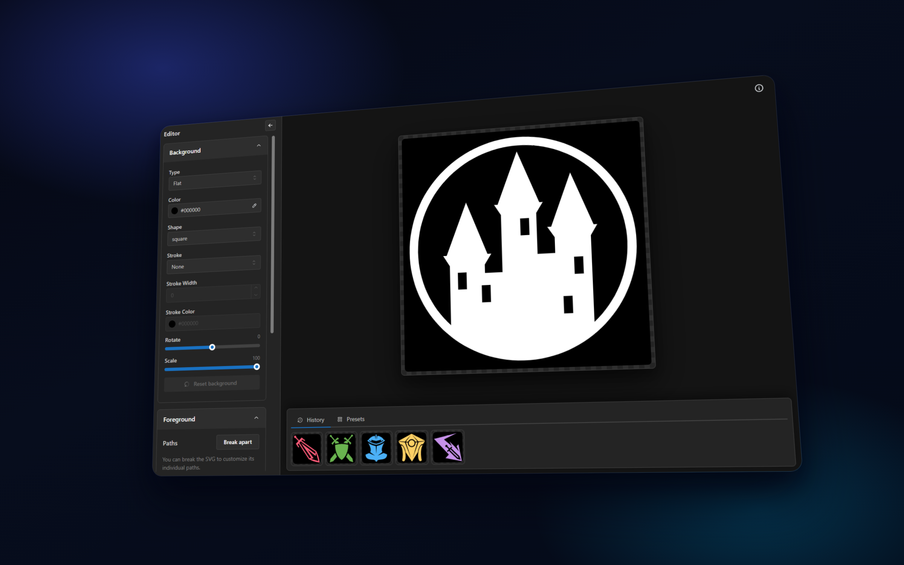

# Aikon (アイコン) 

Aikon is a local studio/playground/editor for building and experimenting with [game icons](https://game-icons.net/).



## Project Status

Aikon is built for game creators and hobbyists who want a local icon lab.

- Run it locally and have fun.
- Expect fast iteration and occasional rough edges.
- It is not intended as a production SaaS/service deployment.

## Features

- Browse a local Game Icons catalog with search.
- Compose layered icons with live visual feedback.
- Tweak style controls for foreground and background.
- Keep per-icon edit history in browser local storage.
- Work offline against local icon files.
- Sync/download icon assets when you decide to refresh local data.

## Tech Stack

- React 19
- TypeScript 5 (strict mode)
- Vite 7
- Mantine UI
- Zustand
- Three.js
- Node.js scripts for icon sync/download tooling

## Quick Start

Requirements:

- Node.js (current LTS recommended)
- npm

Install and run:

```bash
npm install
npm run dev
```

Open `http://localhost:5173`.

## Commands

- `npm run dev`: start the local dev server
- `npm run typecheck`: run TypeScript checks for app and scripts
- `npm run test`: run unit tests
- `npm run build`: create the production bundle in `dist/client`
- `npm run icons:download`: download missing icon SVGs
- `npm run icons:download -- --refresh`: fully refresh local icon SVGs
- `npm run icons:sync`: update local icon lock metadata

## Project Structure

- `src/core`: domain models, editor state, and icon services
- `src/hooks`: UI orchestration hooks
- `src/ui`: editor UI components and panels
- `src/utils`: utility helpers
- `scripts`: icon sync/download scripts
- `public/icons`: local icon assets
- `public/icons.lock.json`: local icon metadata lock

## Data and Assets

Aikon stores icon assets locally in `public/icons` and metadata in `public/icons.lock.json`.
User preferences/history are saved in browser local storage.

## Disclaimer and Credits

Game icon assets are sourced from the amazing Game Icons project:

- Website: [game-icons.net](https://game-icons.net)
- Repository: [game-icons/icons](https://github.com/game-icons/icons)

This project would not be possible without their outstanding work ❤️.

## Contributing

Contributions are welcome from both technical and non-technical folks.
Please follow [CONTRIBUTING.md](./CONTRIBUTING.md).

## License

Aikon is licensed under **AGPL-3.0**.

We chose AGPL-3.0 to ensure improvements to this software are shared back with the community, so everyone keeps the right to study, modify, and benefit from future enhancements.
